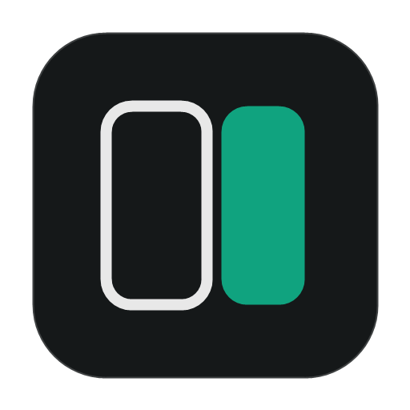
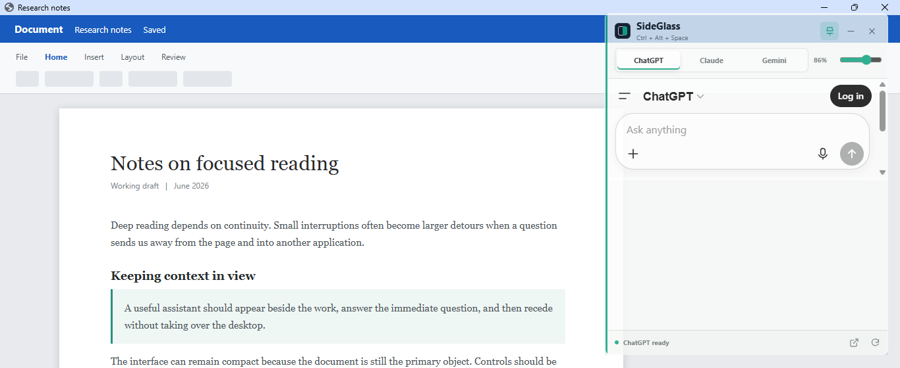

<div align="center">
  

  # SideGlass

  **Ask an AI without leaving the document in front of you.**

  [](https://github.com/hasnain7abbas/sideglass/releases/latest)
  [](#how-it-works)
  [](LICENSE)

  [Download for Windows](https://github.com/hasnain7abbas/sideglass/releases/latest/download/SideGlass-0.2.0.exe)
</div>



SideGlass is the small window I wanted while reading and writing: ChatGPT, Claude, or Gemini stays beside the current document instead of pulling the whole workflow into a browser. The window is translucent, always available through one shortcut, and quiet enough to leave open.

## What it does

- Keeps a compact AI window above other applications.
- Switches between ChatGPT, Claude, and Gemini in one place.
- Uses the providers' normal websites and your existing accounts, with no paid API key.
- Remembers the selected provider, opacity, pin state, size, and position.
- Restores an off-screen window safely after monitor changes.
- Provides retry and browser fallback actions when a provider cannot load.

## Controls

| Control | Action |
| --- | --- |
| `Ctrl + Alt + Space` | Show, focus, or hide SideGlass |
| Provider tabs | Switch AI service |
| Pin | Toggle always-on-top mode |
| Opacity slider | Adjust the whole window from 58% to 100% |
| Reload | Reload the current provider |
| External link | Open the current provider in your browser |

Drag the title area to move the window. Resize it from any edge like a normal desktop app.

## How it works

SideGlass is an Electron shell around each provider's real web app. Sign-in cookies and site data stay in a dedicated persistent session on your computer. SideGlass does not send prompts through its own server and does not require API credentials.

Provider account rules and usage limits still apply. Their websites can also change without notice, so login challenges, CAPTCHA, or temporary embedding issues may occasionally appear.

## Run from source

You need [Node.js](https://nodejs.org/) and npm.

```powershell
git clone https://github.com/hasnain7abbas/sideglass.git
cd sideglass
npm install
npm start
```

Build the portable Windows executable with:

```powershell
npm run dist
```

The output is written to `release/SideGlass-0.2.0.exe`.

## Windows note

The current portable build is not code-signed, so Windows SmartScreen may show a warning on first launch. The source and complete local build command are available above for anyone who prefers to build it directly.

## License

SideGlass is available under the [MIT License](LICENSE).
